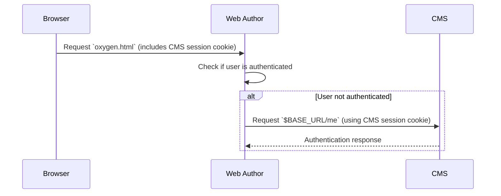
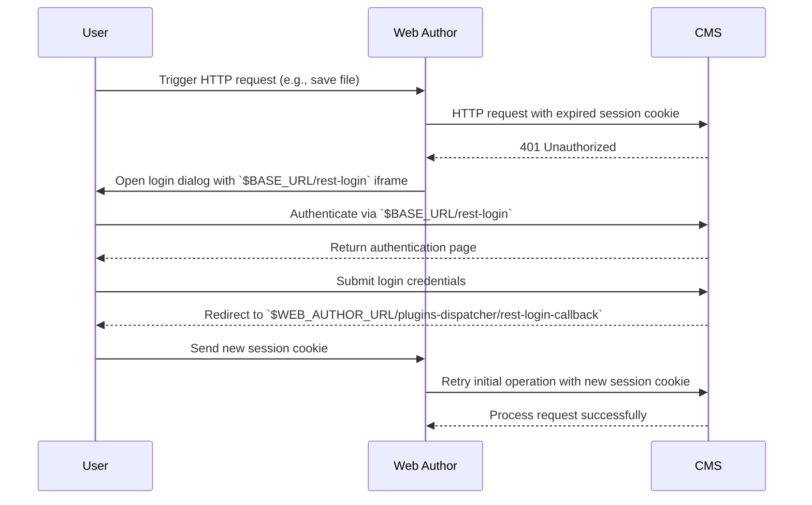
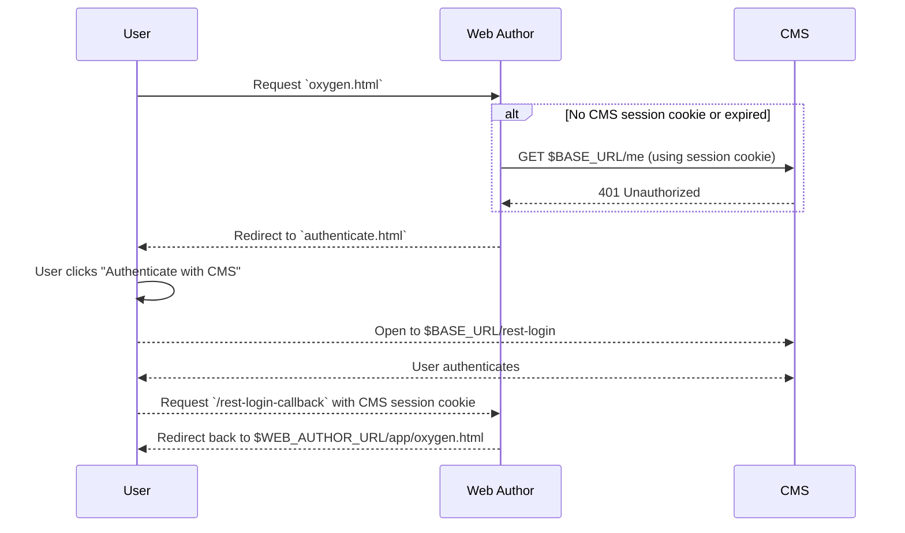

# Cookie-based Authentication

If the REST API requires cookie-based authentication, it should be deployed on the same domain as Web Author.

Below we will denote:
    - the base URL of the REST API as `$BASE_URL`. An example value would be: `http://example.com/oxygen-cms/v1/`
    - the base URL of Web Author as `$WEB_AUTHOR_URL`. An example value would be `http://example.com/oxygen-xml-web-author/app/oxygen.html`.

The resulting architecture would look like in the image below:

## Requests Journey

### Initial authentication
The most common case is when the user already has an authenticated HTTP session with
the CMS.

1. Web Author's `$WEB_AUTHOR_URL/app/oxygen.html` page is requested by the web browser. The web browser, sends the CMS session cookie with this request since Web Author is on the same origin.
2. The Web Author server receives the request and determines if the user is already authenticated. 
3. If the user is not authenticated at step 2, the `web-author-rest-plugin` uses the CMS session cookie to make a request to `$BASE_URL/me`. If this request succeeds, the user is considered authenticated.

### Re-authorization

Another case is when the Web Author editor is opened, but the CMS session expired. So, the user is authenticated, but is not authorized anymore to access the CMS. In this case when the user tries to open or save a file, the following requests happen:

1. The user operation, triggers an HTTP request to the Web Author server, for example to save the currently edited file
2. The Web Author server receives the user request and makes an HTTP request to the CMS using the expired session cookie.
3. The CMS returns the HTTP status code 401
4. Web Author opens a dialog with the `$BASE_URL/rest-login` page opened in an iframe.
5. The CMS responds to the `$BASE_URL/rest-login` with a HTML page that helps the user authenticate to the CMS.
6. After the user logs in, the CMS redirects the user to `$WEB_AUTHOR_URL/plugins-dispatcher/rest-login-callback` and the browser sends the new session cookie with this request.
7. Web Author receives the new session cookie and re-tries the initial operation.

### Re-authentication

If Web Author is opened in a separate browser tab, it may happen that the user opens Web Author without authenticating with the CMS first. 

1. Web Author's `$WEB_AUTHOR_URL/app/oxygen.html` page is requested by the web browser. The web browser either does not have a CMS session cookie, or it is expired. 
  1. If the session cookie is sent, Web Author server tries to use it to obtain the details of the current user from the `$BASE_URL/me` endpoint, but receives HTTP status code 401.
2. The Web Author server redirects the user to the `$WEB_AUTHOR_URL/app/authenticate.html` page. Here the user clicks the "Authenticate with CMS" button.
3. The user is redirected to `$BASE_URL/rest-login` which should be an HTML page that helps the user authenticate to the CMS.
4. The user is redirected to `$WEB_AUTHOR_URL/plugins-dispatcher/rest-login-callback` which in turn redirects the user back to the page from step 1.

## Implementation notes

To implement the re-authorization or re-authentication flow you should do the following:

1. When Web Author connects to the API using no cookies or expired cookies, return `401` status code. 
2. Implement the `$BASE_URL/rest-login` endpoint to return an HTML page with a CMS login form.
3. After the user logs in, to notify Web Author that the login process is completed, you should redirect the user to `$WEB_AUTHOR_URL/plugins-dispatcher/rest-login-callback`.

### Invisible login form

If Web Author is embedded in an iframe inside the CMS application, during the re-authorization flow, you may want to show the CMS login dialog of the parent CMS application.

To this end follow these steps:
- Enable the _Use invisible login form_ option in the *Administration Page* > *Plugins* > *REST Connector* > *Configure...* dialog
- The HTML page returned by `$BASE_URL/rest-login` should include a script to communicate via JS with the parent CMS app to trigger the login dialog.

## Log out 

When the user logs out of the CMS, you need to make a `PUT` request to: `$WEB_AUTHOR_URL/rest/app-authentication/logout` to also terminate the Web Author session.
